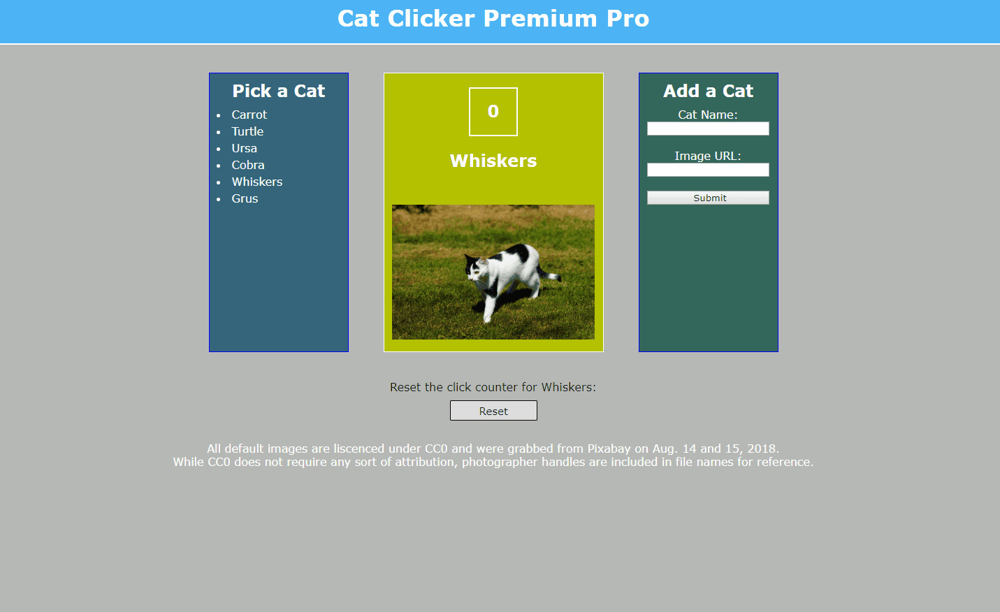
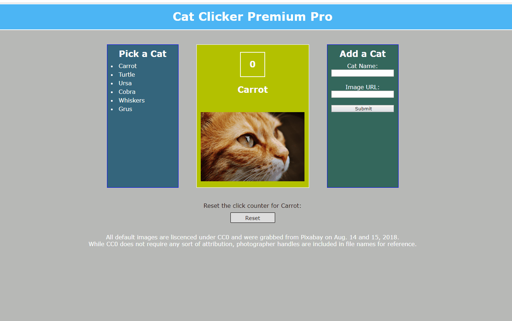

# Cat Clicker Premium | Udacity FEND | 2018

UPDATE: implements Model View Controller / Model View Octopus pattern in `app.js`. 

See `app-original.js` for comparison. 

For more on the MVC/MVO pattern, you may wish to check  out [this article](https://hackernoon.com/the-idea-behind-mvc-a-k-a-mvo-9106f43db456 "The idea behind MVC a.k.a MVO" by Houssain Amrani.) by Houssain Amrani posted at Hacker Noon.

--------------------------------------------------------------------------------
--------------------------------------------------------------------------------
ORIGINAL:

This is my first attempt at making a specified "Cat Clicker Premium" web application, a project completed as part of "Lesson One: Changing Expectations" in "Part 4: Front-End Applications" of Udacity's Front End Web Developer Nanodegree program, 2018.

As instructed, I wrote this code using the knowledge and skills I have gained in the program so far and in accordance with a spec sheet provided by Udacity.

The next step is to reflect on this application's code as I proceed with lessons on organizational techniques aimed at making sure web applications are — to quote instruction from Lesson One — "stable and bug-free" and clearly written," and that they "scale well" and are "extensible," as I work towards developing for the web at a professional level.

## Authors

Jacob W. Olson wrote the code for this web application based on a spec sheet provided by Udacity. Sources are noted in `styles.css` and `app.js`, and are described in the "Acknowledgments" section below.

## Instructions

1. Clone the repository to create a copy on your local machine. Click [here](https://help.github.com/articles/cloning-a-repository/ "GitHub Help — Clone a Repository") for help with this task from GitHub.

2. Open `index.html` in your browser. Some tips for doing this from Help Desk Geek are available [here](https://helpdeskgeek.com/how-to/open-an-html-file-in-google-chrome/ ).

  * Alternatively, you can run the web application via [its GitHub page](https://jacobwolson.github.io/cat-clicker-premium-pro-udacity-fend-2018-grow-with-google-scholarship-mvo-js-object-oriented/). To add a new cat with code from the GitHub page and without cloning the repository, you can follow the instructions for adding a new cat below, but enter your code in to the console rather than in to `app.js`.

3. Click a cat's name to view display its name, picture and "click count" in the center section of the page or `cat-container` `
`.

4. Click the currently-selected cat's image to increment it's click count.

5. Each cat's click count is saved. If you run up the click count on cat "A," then select one or more different cats to display, then go back to cat "A", the click count of cat "A" will be right where you left it.

  * Check out the 17th line of the `.impliment()` method — `markupToDisplay = catContainer.innerHTML` — to see how this works.

5. To clear any cat's click count, hit the 'Reset' while said cat is displayed — or, that is to say, when the 'markup' property for the cat object in question is loaded in to the `cat-container` `
`.

6. To add a new cat to the list, you might first try using the entry fields and submit button in the "Add a Cat" section of the page.

  * Be sure the URL you include is of an image only! Which means if you are looking at an image on a website, you may need to 'open image in a new tab' — or you can link to the URL of any other hosted image.

7. You can also add a few simple lines of code to add your new cat:

  * In `app.js`, in the global scope, add the code `let <newCatName> = new Cat('<Your new cat's name here>', '<link to image of your new cat>');` to create the new cat object.

  * Next, call the `.addToList()` method on the new object like so: `<newCatName>.addToList()`.

  * Example:

    `let bootes = new Cat('Bootes', 'https://cdn.pixabay.com/photo/2017/02/20/18/03/cat-2083492_960_720.jpg');
     bootes.addToList();`

  * Save your updates to `app.js`, and refresh your browser. You should see your new cat added to the cat list, and your new cat should display when its name is clicked, and, when its displayed image is clicked, its click count should increment.

  * Note: as noted above, if you are viewing the app via [its Git Hub page](https://jacobwolson.github.io/cat-clicker-premium-version-one-udacity-fend-2018-grow-with-google-scholarship/) or directly displaying it from the repository any other way — such as with [HTML Preview](http://htmlpreview.github.io/) — you can add your cat by entering the code lines above in to the console. For notes on using the JavaScript console, you may wish to check out [this article from Digital Ocean](https://www.digitalocean.com/community/tutorials/how-to-use-the-javascript-developer-console).

8. Enjoy! Feedback and suggestions welcome and appreciated 🐱.

## Acknowledgements

* Udcatity's Front End Web Developer Nanodegree program provided the instructions for this project. The program also provided the structure and much of the information I needed to learn the basics of HTML, CSS and JavaScript, which allowed me to successfully create this web application.

* This README is based on [a template by Billie Thompson](https://gist.github.com/PurpleBooth/109311bb0361f32d87a2) posted as a gist under the username "PurpleBooth." The Github repository ["Awesome README" by Matias Singers](https://github.com/matiassingers/awesome-readme) posting under the username "matiassingers" was also consulted. Accessed 2018.

* The color scheme for this web application's page, "Fresh & Energetic," is from the article ["100 brilliant color combinations and how to apply them to your designs" by Janie Kliever](https://www.canva.com/learn/100-color-combinations/) posted on Canva. Accessed August 15, 2018.

* The HTML for the input field that allows users to add a new cat object to the application from inside the page is adapted from [an example posted on W3 Schools](https://www.w3schools.com/html/html_forms.asp). Accessed Aug. 15, 2018.

* The technique used for grabbing the values of the `input` fields used for adding new cats from within the page is informed by [a May 27, 2017, post by Peter Mortensen on Stack Overflow](https://stackoverflow.com/a/11563667). Accessed Aug. 15, 2018.

* The technique used for getting the submit button for adding new cats to work without technically submitting a form is based on [a Jan. 21, 2018, post by Benjamin Gruenbaum on Stack Overflow](https://stackoverflow.com/a/21263484). Accessed Aug. 15, 2018.

* All images for the cat objects loaded to the page by default were marked as having copyright protections waived under CC0 and were grabbed from [Pixabay](https://pixabay.com/) on August 15 and 16, 2018.

  * While CC0 does not call for attribution unless explicitly requested, the Pixabay handles of the photographers whom the photos were associated with on the site are included in the file names of each photo for reference.

* Documentation on [MDN Web Docs](https://developer.mozilla.org/) as well as tutorials and references on [W3 School's](https://www.w3schools.com/) provided indispensable information for creating this web application.

* My fellow Udacity students as well as the wider programming community also provided indispensable information, resources, support and encouragement that allowed me get to the point where I am at the time of creating this web application and writing this README.

* Funding for my learning through Udacity including this project comes courtesy of the Grow with Google Scholarship program.
